# Elementary gates for quantum computation

**Adriano Barenco, Charles H. Bennett, Richard Cleve, David P. DiVincenzo, Norman Margolus, Peter Shor, Tycho Sleator, John Smolin, and Harald Weinfurter**

| Author | Affiliation and contact in the submitted manuscript |
|---|---|
| Adriano Barenco | Clarendon Laboratory, Oxford OX1 3PU, UK; `a.barenco@mildred.physics.ox.ac.uk` |
| Charles H. Bennett | IBM Research, Yorktown Heights, New York, NY 10598, USA |
| Richard Cleve | Department of Computer Science, Calgary, Alberta, Canada T2N 1N4; `cleve@cpsc.ucalgary.ca` |
| David P. DiVincenzo | IBM Research, Yorktown Heights, New York, NY 10598, USA |
| Norman Margolus | Laboratory for Computer Science, Cambridge, MA 02139, USA; `nhm@im.lcs.mit.edu` |
| Peter Shor | AT&T Bell Laboratories, Murray Hill, NJ 07974, USA; `shor@research.att.com` |
| Tycho Sleator | Physics Department, New York University, New York, NY 10003, USA; `tycho@sleator.physics.nyu.edu` |
| John Smolin | Physics Department, UCLA, Los Angeles, CA 90024, USA, and IBM Research; `smolin@vesta.physics.ucla.edu` |
| Harald Weinfurter | Institute for Experimental Physics, A-6020 Innsbruck, Austria; `harald.weinfurter@uibk.ac.at` |

*Submitted to Physical Review A, March 22, 1995 (AC5710). arXiv version submitted March 23, 1995.*

> We show that a set of gates that consists of all one-bit quantum gates, $U(2)$, and the two-bit exclusive-or gate, which maps Boolean values $(x,y)$ to $(x,x\oplus y)$, is universal in the sense that all unitary operations on arbitrarily many bits $n$, $U(2^n)$, can be expressed as compositions of these gates. We investigate the number of the above gates required to implement other gates, such as generalized Deutsch-Toffoli gates, that apply a specific $U(2)$ transformation to one input bit if and only if the logical AND of all remaining input bits is satisfied. These gates play a central role in many proposed constructions of quantum computational networks. We derive upper and lower bounds on the exact number of elementary gates required to build up a variety of two- and three-bit quantum gates, the asymptotic number required for $n$-bit Deutsch-Toffoli gates, and make some observations about the number required for arbitrary $n$-bit unitary operations.

**PACS numbers:** 03.65.Ca, 07.05.Bx, 02.70.Rw, 89.80.+h

**Citation:** *Physical Review A* **52**, 3457-3467 (1995). DOI: <https://doi.org/10.1103/PhysRevA.52.3457>  
**arXiv:** <https://arxiv.org/abs/quant-ph/9503016>

> **Conversion note.** This Markdown edition is a clean structural conversion of the supplied 31-page arXiv manuscript. Page numbers and repeated running material are omitted. Mathematical notation uses `$...$` for inline math and `$$...$$` for display math. The original manuscript contains circuit drawings embedded directly in the typeset pages rather than separately numbered figures; those drawings have been cropped into `images/` and placed beside the corresponding lemmas.

## 1. Background

It has recently been recognized, after fifty years of using the paradigms of classical physics, as embodied in the Turing machine, to build a theory of computation, that quantum physics provides another paradigm with clearly different and possibly much more powerful features than established computational theory. In quantum computation, the state of the computer is described by a state vector $\Psi$, which is a complex linear superposition of all binary states of the bits $x_m\in\{0,1\}$:

$$
\Psi(t)=\sum_{x\in\{0,1\}^m}\alpha_x\lvert x_1,\ldots,x_m\rangle,
\qquad
\sum_x\lvert\alpha_x\rvert^2=1.
$$

The state's evolution in the course of time $t$ is described by a unitary operator $U$ on this vector space, that is, a linear transformation which is bijective and length-preserving. This unitary evolution on a normalized state vector is known to be the correct physical description of an isolated system evolving in time according to the laws of quantum mechanics [1].

Historically, the idea that the quantum mechanics of isolated systems should be studied as a new formal system for computation arose from the recognition twenty years ago that computation could be made reversible within the paradigm of classical physics. It is possible to perform any computation in a way that is reversible both logically - the computation is a sequence of bijective transformations - and thermodynamically - the computation could in principle be performed by a physical apparatus dissipating arbitrarily little energy [2]. A formalism for constructing reversible Turing machines and reversible gate arrays, or reversible combinational logic, was developed. Fredkin and Toffoli [3] showed that there exists a three-bit "universal gate" for reversible computation: a gate which, when applied in succession to different triplets of bits in a gate array, can simulate any arbitrary reversible computation. Two-bit gates such as NAND, which are universal for ordinary computation, are not reversible. Toffoli's version [4] of the universal reversible gate will figure prominently in the body of this paper.

Quantum physics is also reversible, because the reverse-time evolution specified by the unitary operator

$$
U^{-1}=U^\dagger
$$

always exists. As a consequence, several workers recognized that reversible computation could be executed within a quantum-mechanical system. Quantum-mechanical Turing machines [5, 6], gate arrays [7], and cellular automata [8] have been discussed, and physical realizations of Toffoli's [9-11] and Fredkin's [12-14] universal three-bit gates within various quantum-mechanical physical systems have been proposed.

While reversible computation is contained within quantum mechanics, it is a small subset: the time evolution of a classical reversible computer is described by unitary operators whose matrix elements are only zero or one - arbitrary complex numbers are not allowed. Unitary time evolution can of course be simulated by a classical computer, for example an analog optical computer governed by Maxwell's equations [15], but the dimension of the unitary operator thus attainable is bounded by the number of classical degrees of freedom, roughly proportional to the size of the apparatus. By contrast, a quantum computer with $m$ physical bits can perform unitary operations in a space of $2^m$ dimensions, exponentially larger than its physical size.

Deutsch [16] introduced a quantum Turing machine intended to generate and operate on arbitrary superpositions of states, and proposed that, aside from simulating the evolution of quantum systems more economically than known classical methods, it might also be able to solve certain classical problems - problems with a classical input and output - faster than any classical Turing machine. In a series of artificial settings, with appropriately chosen oracles, quantum computers were shown to be qualitatively stronger than classical ones [17-20], culminating in Shor's [21, 22] discovery of quantum polynomial-time algorithms for two important natural problems, factoring and discrete logarithm, for which no polynomial-time classical algorithm was known. The search for other such problems, and the physical question of the feasibility of building a quantum computer, are major topics of investigation today [23].

The formalism used here for quantum computation, called a quantum *gate array*, was introduced by Deutsch [24], who showed that a simple generalization of the Toffoli gate - the three-bit gate $\wedge_2(R_x)$ in the language introduced later in this paper - suffices as a universal gate for quantum computing. The quantum gate array is the natural quantum generalization of the acyclic combinational-logic circuits studied in conventional computational complexity theory. It consists of quantum gates, interconnected without fanout or feedback by quantum wires. The gates have the same number of inputs as outputs, and a gate of $n$ inputs carries a unitary operation in the group $U(2^n)$, a generalized rotation in a Hilbert space of dimension $2^n$.

Each wire represents a quantum bit, or qubit [25, 26]: a quantum system with a two-dimensional Hilbert space, capable of existing in a superposition of Boolean states and of being entangled with the states of other qubits. Where there is no danger of confusion, the term "bit" is used in either the classical or quantum sense. Just as classical bit strings can represent discrete states of arbitrary finite dimensionality, a string of $n$ qubits can represent quantum states in any Hilbert space of dimensionality up to $2^n$.

The analysis of quantum Turing machines [20] is complicated by the fact that not only the data but also the control variables, such as the head position, can exist in a superposition of classical states. Fortunately, Yao [27] showed that acyclic quantum gate arrays can simulate quantum Turing machines. Gate arrays are easier to think about because the control variables - the wiring diagram itself and the number of computation steps executed so far - can be treated as classical, with only the data in the wires being quantum.

This paper derives a series of results that provide new tools for building unitary transformations from simple gates. It builds on other recent results that simplify and extend Deutsch's original discovery [24] of a three-bit universal quantum logic gate. As a consequence of the greater power of quantum computing as a formal system, there are many more choices for a universal gate than in classical reversible computing. DiVincenzo [28] showed that two-bit universal quantum gates are possible; Barenco [29] extended this to show that almost any two-bit gate within a certain restricted class is universal; and Lloyd [30] and Deutsch *et al.* [31] showed that almost any two-bit or $n$-bit gate, for $n\geq2$, is also universal. A closely related construction for the Fredkin gate was given in [32]. The present paper takes a different route, showing that a non-universal classical two-bit gate, in conjunction with quantum one-bit gates, is also universal.

With this universal-gate repertoire, the paper also exhibits efficient schemes for building certain classes of $n$-bit operations. Strategies for constructing gate arrays efficiently are important for understanding the full power of quantum mechanics for computation; such constructions had already proved useful for understanding the scaling of Shor's prime-factorization algorithm [33]. The present work partly builds on the strategy introduced by Sleator and Weinfurter [9], who gave a scheme for obtaining the Toffoli gate with exactly five two-bit gates. Their approach is generalized and extended in several ways to obtain more general efficient gate constructions. Some of the results presented here have no obvious connection with previous gate-assembly schemes.

The paper does not address the great difficulties attendant on the physical realization of a quantum computer. The problems of error correction [34] and quantum coherence [35, 36] are very serious. Reference [37] is cited for a comprehensive discussion of these difficulties.

## 2. Introduction

We begin by introducing some basic ideas and notation. For any unitary

$$
U=
\begin{pmatrix}
u_{00} & u_{01}\\
u_{10} & u_{11}
\end{pmatrix},
$$

and $m\in\{0,1,2,\ldots\}$, define the $(m+1)$-bit, $2^{m+1}$-dimensional operator $\wedge_m(U)$ by

$$
\wedge_m(U)\lvert x_1,\ldots,x_m,y\rangle=
\begin{cases}
u_{y0}\lvert x_1,\ldots,x_m,0\rangle+u_{y1}\lvert x_1,\ldots,x_m,1\rangle,
& \displaystyle\bigwedge_{k=1}^m x_k=1,\\[4pt]
\lvert x_1,\ldots,x_m,y\rangle,
& \displaystyle\bigwedge_{k=1}^m x_k=0,
\end{cases}
$$

for all $x_1,\ldots,x_m,y\in\{0,1\}$. Here $\bigwedge_{k=1}^m x_k$ denotes the logical AND of the Boolean variables $\{x_k\}$. The operator $\wedge_0(U)$ is identified with $U$. In the lexicographically ordered basis, the matrix corresponding to $\wedge_m(U)$ is the identity except for its lower-right $2\times2$ block:

$$
\wedge_m(U)=
\begin{pmatrix}
1\\
&1\\
&&\ddots\\
&&&1\\
&&&&u_{00}&u_{01}\\
&&&&u_{10}&u_{11}
\end{pmatrix}.
$$

When

$$
U=\sigma_x=
\begin{pmatrix}
0&1\\
1&0
\end{pmatrix},
$$

$\wedge_m(U)$ is the Toffoli gate [4] with $m+1$ input bits. It maps

$$
\lvert x_1,\ldots,x_m,y\rangle
\longmapsto
\left\lvert x_1,\ldots,x_m,
\left(\bigwedge_{k=1}^m x_k\right)\oplus y
\right\rangle.
$$

For general $U$, $\wedge_m(U)$ is a generalized Toffoli gate: it applies $U$ to $y$ if and only if $\bigwedge_{k=1}^m x_k=1$.

As shown in [31, 29], "almost any" single $\wedge_1(U)$ gate is universal in the sense that successive applications of the gate to pairs of bits in an $n$-bit network can approximate any unitary transformation with arbitrary accuracy. It suffices for $U$ to be specified by Euler angles that are not rational multiples of $\pi$.

The paper shows that this result can be made simpler in another sense: any unitary transformation in a network can be constructed using only the classical two-bit gate

$$
\wedge_1(\sigma_x)
$$

and a set of one-bit operations of the form $\wedge_0(U)$. From the perspective of classical reversible computation, this is remarkable. The classical analogue - that all invertible Boolean functions could be implemented with $\wedge_1(\sigma_x)$ and $\wedge_0(\sigma_x)$ - is false [38]. Only a tiny fraction of Boolean functions, those linear with respect to modulo-two arithmetic, can be generated with these gates [39].

The paper also gives explicit constructions of $\wedge_m(U)$ from $\wedge_1(U)$, all polynomial in $m$. The analogous classical constructions of $\wedge_m(\sigma_x)$ from the three-bit Toffoli gate $\wedge_2(\sigma_x)$ are also polynomial in $m$ [4]. There is, however, an important difference. Toffoli showed [4] that the classical $\wedge_m$ gates could not be built without work bits to store intermediate results. By contrast, the quantum logic gates can always be constructed with no workspace. Similar classical computations using very few or no work bits appeared in the work of Cleve [40] and Ben-Or and Cleve [41]. Workspace nevertheless plays an important role in quantum gate constructions: introducing one work bit reduces the exact implementation time for a family of $\wedge_m$ gates from $\Theta(m^2)$ to $\Theta(m)$.

## 3. Notation

The paper adopts a version of Feynman's notation [7] for $\wedge_m(U)$ gates and Toffoli gates in quantum networks.

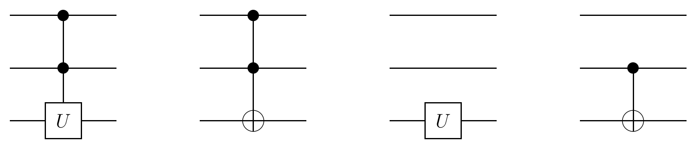

From left to right, the drawings show a $\wedge_2(U)$ gate, a three-bit Toffoli gate, a one-bit $\wedge_0(U)$ gate, and a two-bit reversible exclusive-or gate. In accordance with the preceding definition, the top two wires in the first two drawings hold the input bits $x_1$ and $x_2$, and the third wire holds $y$ [42].

The two-bit reversible exclusive-or gate is called **XOR** throughout the paper. It was introduced as the "measurement gate" in [24] and plays a prominent role in the constructions below. A **basic operation** means either a one-bit $\wedge_0(U)$ gate or this two-bit XOR gate.

Time advances from left to right in every gate-array diagram: the leftmost gate operates first.

## 4. Matrix properties

**Lemma 4.1.** Every unitary $2\times2$ matrix can be expressed as

$$
\begin{pmatrix}
e^{i\delta}&0\\
0&e^{i\delta}
\end{pmatrix}
\begin{pmatrix}
e^{i\alpha/2}&0\\
0&e^{-i\alpha/2}
\end{pmatrix}
\begin{pmatrix}
\cos(\theta/2)&\sin(\theta/2)\\
-\sin(\theta/2)&\cos(\theta/2)
\end{pmatrix}
\begin{pmatrix}
e^{i\beta/2}&0\\
0&e^{-i\beta/2}
\end{pmatrix},
$$

where $\delta$, $\alpha$, $\theta$, and $\beta$ are real. Every special unitary $2\times2$ matrix, with determinant one, can be expressed without the first factor:

$$
\begin{pmatrix}
e^{i\alpha/2}&0\\
0&e^{-i\alpha/2}
\end{pmatrix}
\begin{pmatrix}
\cos(\theta/2)&\sin(\theta/2)\\
-\sin(\theta/2)&\cos(\theta/2)
\end{pmatrix}
\begin{pmatrix}
e^{i\beta/2}&0\\
0&e^{-i\beta/2}
\end{pmatrix}.
$$

**Proof.** A matrix is unitary if and only if its row and column vectors are orthonormal. Every $2\times2$ unitary matrix therefore has the form

$$
\begin{pmatrix}
e^{i(\delta+\alpha/2+\beta/2)}\cos(\theta/2)
& e^{i(\delta+\alpha/2-\beta/2)}\sin(\theta/2)\\
-e^{i(\delta-\alpha/2+\beta/2)}\sin(\theta/2)
& e^{i(\delta-\alpha/2-\beta/2)}\cos(\theta/2)
\end{pmatrix}.
$$

The first factorization follows immediately. In the special-unitary case, the determinant of the first matrix must be one, implying $e^{i\delta}=\pm1$, so that matrix can be absorbed into the second factor. $\square$

**Definition.** In view of Lemma 4.1, define

$$
R_y(\theta)=
\begin{pmatrix}
\cos(\theta/2)&\sin(\theta/2)\\
-\sin(\theta/2)&\cos(\theta/2)
\end{pmatrix},
$$

a rotation by $\theta$ about $\hat y$ [43];

$$
R_z(\alpha)=
\begin{pmatrix}
e^{i\alpha/2}&0\\
0&e^{-i\alpha/2}
\end{pmatrix},
$$

a rotation by $\alpha$ about $\hat z$;

$$
\operatorname{Ph}(\delta)=
\begin{pmatrix}
e^{i\delta}&0\\
0&e^{i\delta}
\end{pmatrix},
$$

a phase shift by $\delta$;

$$
\sigma_x=
\begin{pmatrix}
0&1\\
1&0
\end{pmatrix},
\qquad
I=
\begin{pmatrix}
1&0\\
0&1
\end{pmatrix}.
$$

**Lemma 4.2.** The following properties hold:

1. $R_y(\theta_1)R_y(\theta_2)=R_y(\theta_1+\theta_2)$.
2. $R_z(\alpha_1)R_z(\alpha_2)=R_z(\alpha_1+\alpha_2)$.
3. $\operatorname{Ph}(\delta_1)\operatorname{Ph}(\delta_2)=\operatorname{Ph}(\delta_1+\delta_2)$.
4. $\sigma_x\sigma_x=I$.
5. $\sigma_xR_y(\theta)\sigma_x=R_y(-\theta)$.
6. $\sigma_xR_z(\alpha)\sigma_x=R_z(-\alpha)$.

**Lemma 4.3.** For any special unitary matrix $W\in SU(2)$, there exist $A,B,C\in SU(2)$ such that

$$
ABC=I,
\qquad
A\sigma_xB\sigma_xC=W.
$$

**Proof.** By Lemma 4.1, choose $\alpha$, $\theta$, and $\beta$ so that

$$
W=R_z(\alpha)R_y(\theta)R_z(\beta).
$$

Set

$$
A=R_z(\alpha)R_y\!\left(\frac\theta2\right),
$$

$$
B=R_y\!\left(-\frac\theta2\right)
R_z\!\left(-\frac{\alpha+\beta}{2}\right),
$$

and

$$
C=R_z\!\left(\frac{\beta-\alpha}{2}\right).
$$

Then

$$
\begin{aligned}
ABC
&=R_z(\alpha)R_y\!\left(\frac\theta2\right)
R_y\!\left(-\frac\theta2\right)
R_z\!\left(-\frac{\alpha+\beta}{2}\right)
R_z\!\left(\frac{\beta-\alpha}{2}\right)\\
&=R_z(\alpha)R_z(-\alpha)\\
&=I,
\end{aligned}
$$

and, using Lemma 4.2,

$$
\begin{aligned}
A\sigma_xB\sigma_xC
&=R_z(\alpha)R_y\!\left(\frac\theta2\right)
\sigma_xR_y\!\left(-\frac\theta2\right)
R_z\!\left(-\frac{\alpha+\beta}{2}\right)
\sigma_xR_z\!\left(\frac{\beta-\alpha}{2}\right)\\
&=R_z(\alpha)R_y\!\left(\frac\theta2\right)
R_y\!\left(\frac\theta2\right)
R_z\!\left(\frac{\alpha+\beta}{2}\right)
R_z\!\left(\frac{\beta-\alpha}{2}\right)\\
&=R_z(\alpha)R_y(\theta)R_z(\beta)\\
&=W.
\end{aligned}
$$

$\square$

## 5. Two-bit networks

### 5.1. Simulation of general $\wedge_1(U)$ gates

**Lemma 5.1.** For a unitary $2\times2$ matrix $W$, a $\wedge_1(W)$ gate can be simulated by the network below, with $A,B,C\in SU(2)$, if and only if $W\in SU(2)$.

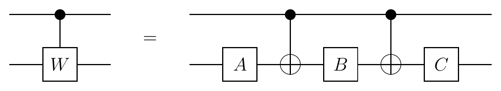

**Proof.** For the "if" direction, let $A$, $B$, and $C$ be as in Lemma 4.3. If the top bit is zero, the lower bit receives $ABC=I$. If the top bit is one, the lower bit receives $A\sigma_xB\sigma_xC=W$.

For the "only if" direction, correctness when the first bit is zero requires $ABC=I$. If the network simulates $\wedge_1(W)$, then $A\sigma_xB\sigma_xC=W$. Since

$$
\det(A\sigma_xB\sigma_xC)=1,
$$

$W$ must be special unitary. $\square$

**Lemma 5.2.** For any $\delta$ and $S=\operatorname{Ph}(\delta)$, a $\wedge_1(S)$ gate can be simulated by the following network, where $E$ is unitary.

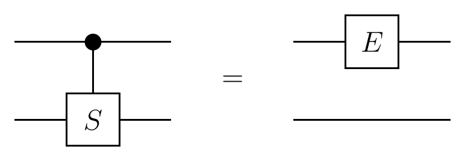

**Proof.** Let

$$
E=R_z(-\delta)\operatorname{Ph}\!\left(\frac\delta2\right)
=
\begin{pmatrix}
1&0\\
0&e^{i\delta}
\end{pmatrix}.
$$

The $4\times4$ unitary matrix corresponding to either side of the diagram is

$$
\begin{pmatrix}
1&0&0&0\\
0&1&0&0\\
0&0&e^{i\delta}&0\\
0&0&0&e^{i\delta}
\end{pmatrix}.
$$

$\square$

Clearly, composing $\wedge_1(S)$ with $\wedge_1(W)$ yields $\wedge_1(SW)$. Every unitary $U$ can be written as $U=SW$, where $S=\operatorname{Ph}(\delta)$ and $W\in SU(2)$. Therefore:

**Corollary 5.3.** Any $\wedge_1(U)$ gate can be simulated using at most six basic gates: four one-bit gates and two XOR gates $\wedge_1(\sigma_x)$.

### 5.2. Special cases

The general simulation can be shortened for special choices of $U$. Lemma 5.1 immediately gives a more efficient simulation for every special unitary matrix. For example, the $x$-axis rotation

$$
R_x(\theta)=
\begin{pmatrix}
\cos(\theta/2)&i\sin(\theta/2)\\
i\sin(\theta/2)&\cos(\theta/2)
\end{pmatrix}
=R_z\!\left(\frac\pi2\right)R_y(\theta)R_z\!\left(-\frac\pi2\right)
$$

is special unitary. The matrix $R_x$ is of particular interest because $\wedge_2(iR_x)$ is the Deutsch gate [24], which was shown to be universal for quantum logic.

**Lemma 5.4.** A $\wedge_1(W)$ gate can be simulated by the network below, with $A,B\in SU(2)$, if and only if

$$
W=R_z(\alpha)R_y(\theta)R_z(\alpha)
=
\begin{pmatrix}
e^{i\alpha}\cos(\theta/2)&\sin(\theta/2)\\
-\sin(\theta/2)&e^{-i\alpha}\cos(\theta/2)
\end{pmatrix},
$$

where $\alpha$ and $\theta$ are real.

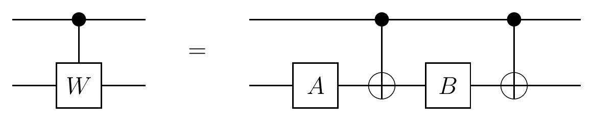

**Proof.** For the "if" direction, specialize the construction of Lemma 5.1 to

$$
W=R_z(\alpha)R_y(\theta)R_z(\alpha).
$$

Then

$$
A=R_z(\alpha)R_y\!\left(\frac\theta2\right),
\qquad
B=R_y\!\left(-\frac\theta2\right)R_z(-\alpha),
\qquad
C=I.
$$

Thus $B=A^\dagger$ and $C$ can be omitted.

For the "only if" direction, correctness when the first bit is zero requires $B=A^\dagger$. When the first bit is one, the lower bit receives $A\sigma_xA^\dagger\sigma_x$. The matrix $A\sigma_xA^\dagger$ has determinant $-1$ and is traceless. Specializing Lemma 4.1 to traceless unitary matrices with determinant $-1$ gives

$$
A\sigma_xA^\dagger=
\begin{pmatrix}
\sin(\theta/2)&e^{i\alpha}\cos(\theta/2)\\
e^{-i\alpha}\cos(\theta/2)&-\sin(\theta/2)
\end{pmatrix}.
$$

Therefore

$$
A\sigma_xA^\dagger\sigma_x=
\begin{pmatrix}
e^{i\alpha}\cos(\theta/2)&\sin(\theta/2)\\
-\sin(\theta/2)&e^{-i\alpha}\cos(\theta/2)
\end{pmatrix},
$$

as required. $\square$

Examples of matrices of the form in Lemma 5.4 include $R_y(\theta)$ and

$$
R_z(\alpha)=R_z\!\left(\frac\alpha2\right)R_y(0)R_z\!\left(\frac\alpha2\right).
$$

The matrix $R_x(\theta)$ is not of this form.

**Lemma 5.5.** A $\wedge_1(V)$ gate can be simulated by the following construction with unitary $A$ and $B$ if and only if

$$
V=R_z(\alpha)R_y(\theta)R_z(\alpha)\sigma_x
=
\begin{pmatrix}
\sin(\theta/2)&e^{i\alpha}\cos(\theta/2)\\
e^{-i\alpha}\cos(\theta/2)&-\sin(\theta/2)
\end{pmatrix},
$$

where $\alpha$ and $\theta$ are real.

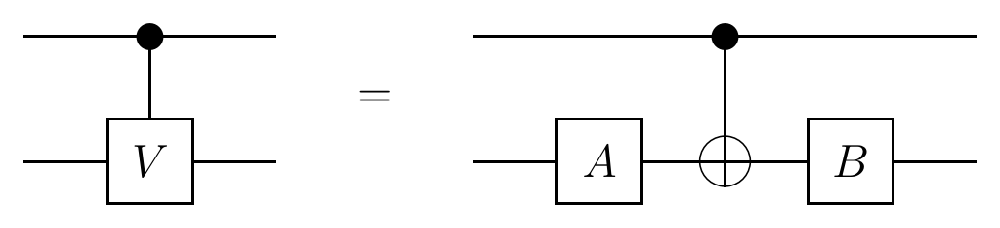

**Proof.** Append an additional $\wedge_1(\sigma_x)$ to the end of the network in Lemma 5.4. Because $\wedge_1(\sigma_x)$ is an involution, the resulting network is equivalent to the one shown above and simulates $\wedge_1(W\sigma_x)$. $\square$

Examples of matrices of the form in Lemma 5.5 include the Pauli matrices

$$
\sigma_y=
\begin{pmatrix}
0&-i\\
i&0
\end{pmatrix}
=R_z\!\left(\frac\pi2\right)R_y(2\pi)R_z\!\left(\frac\pi2\right)\sigma_x
$$

and

$$
\sigma_z=
\begin{pmatrix}
1&0\\
0&-1
\end{pmatrix}
=R_z(0)R_y(\pi)R_z(0)\sigma_x,
$$

as well as $\sigma_x$ itself.

**Corollary 5.6.** For any unitary $2\times2$ matrix $U$, a $\wedge_1(U)$ gate can be simulated by at most six basic gates: four one-bit gates and two $\wedge_1(V)$ gates, where

$$
V=R_z(\alpha)R_y(\theta)R_z(\alpha)\sigma_x.
$$

A $\wedge_1(\sigma_z)$ gate is symmetric with respect to its two input bits. The paper introduces a special two-square notation for it and shows the equivalence of either wire serving as the control:

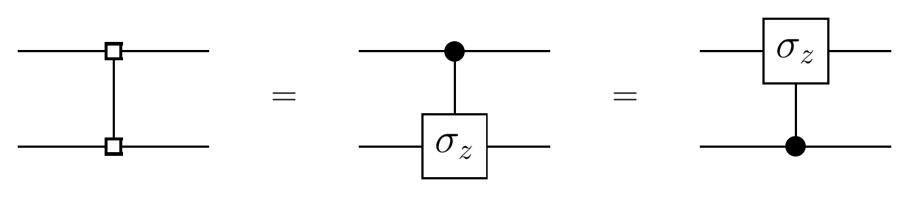

## 6. Three-bit networks

### 6.1. Simulation of general $\wedge_2(U)$ gates

**Lemma 6.1.** For any unitary $2\times2$ matrix $U$, a $\wedge_2(U)$ gate can be simulated by the network below, where $V$ is unitary.

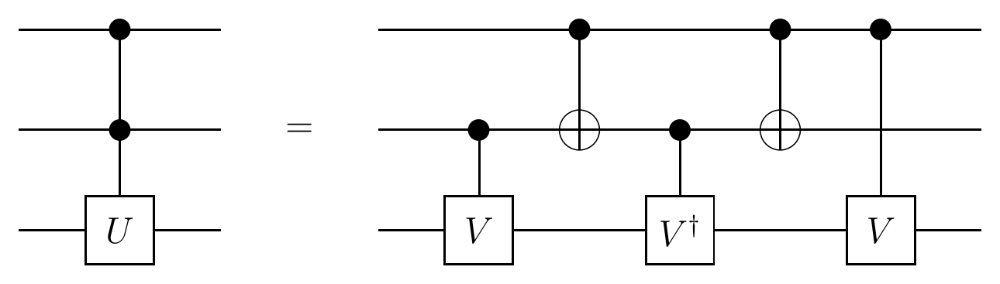

**Proof.** Choose $V$ so that

$$
V^2=U.
$$

If either of the first two bits is zero, the transformation on the third bit is either $I$ or $VV^\dagger=I$. If both first bits are one, the third bit receives $VV=U$. $\square$

The construction can also be understood arithmetically. If the first two input bits are $x_1$ and $x_2$, the third bit receives $V$ if $x_1=1$, $V$ if $x_2=1$, and $V^\dagger$ if $x_1\oplus x_2=1$. Since

$$
x_1+x_2-(x_1\oplus x_2)=2(x_1\wedge x_2),
$$

this sequence is equivalent to applying $V^2$ to the third bit if and only if $x_1\wedge x_2=1$. Thus it realizes $\wedge_2(V^2)$. The same idea generalizes to simulations of $\wedge_m\!\left(V^{2^{m-1}}\right)$ for $m>2$.

Combining Lemma 6.1 with Corollary 5.3 gives a construction of $\wedge_2(U)$ using only one-bit gates and XOR gates. Several adjacent one-bit gates merge or cancel. In particular, the final $\wedge_0(C)$ from the first $\wedge_1(V)$ simulation cancels the $\wedge_0(C^\dagger)$ from the $\wedge_1(V^\dagger)$ simulation, and an analogous cancellation removes a pair $\wedge_0(A)$ and $\wedge_0(A^\dagger)$.

**Corollary 6.2.** Any $\wedge_2(U)$ gate can be simulated using at most sixteen basic gates: eight one-bit gates and eight XOR gates.

For $U=\sigma_x$, this gives a simulation of the three-bit Toffoli gate $\wedge_2(\sigma_x)$, the primitive gate for classical reversible logic [4]. Because $\wedge_2(\sigma_x)$ is its own inverse, either the Lemma 6.1 simulation or its time-reversed simulation can be used; in the reversed version, the gate order is reversed and every unitary is replaced by its Hermitian conjugate.

### 6.2. Three-bit gates congruent to $\wedge_2(U)$

More efficient three-bit simulations are possible if nonzero phase shifts of computational-basis states are permitted. Define

$$
W=
\begin{pmatrix}
0&1\\
-1&0
\end{pmatrix}
=\operatorname{Ph}\!\left(\frac\pi2\right)\sigma_y.
$$

The gates $\wedge_2(W)$ and $\wedge_2(\sigma_x)$ are congruent modulo phase shifts: they differ only because the former maps $\lvert111\rangle$ to $-\lvert110\rangle$ instead of $\lvert110\rangle$. Such a difference is acceptable when the gate merely mimics classical reversible computation, or when a second similar gate later cancels the extra phase, as in Corollary 7.4. It is dangerous in a general computation containing nonclassical unitary operations. Gates congruent to $\wedge_2(\sigma_x)$ modulo phase shifts were previously investigated in [44].

A gate congruent to $\wedge_2(\sigma_x)$ modulo phase shifts has the following efficient simulation, with

$$
A=R_y\!\left(\frac\pi4\right).
$$

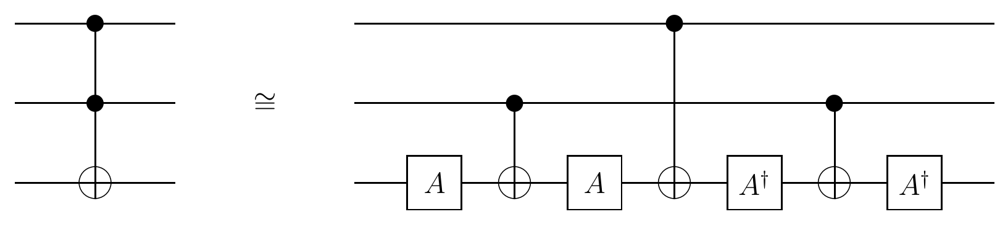

The symbol $\cong$ indicates that the two networks are not identical but differ only by signs of basis-state amplitudes. In this case, the phase of $\lvert101\rangle$ is reversed.

An alternative construction with the same phase shifts uses

$$
B=R_y\!\left(\frac{3\pi}{4}\right).
$$

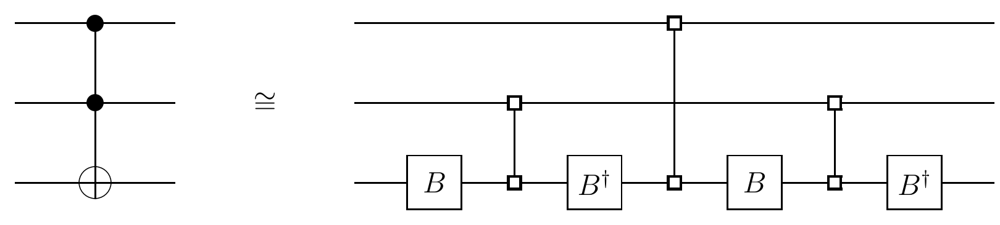

## 7. $n$-bit networks

The Lemma 6.1 technique generalizes from $\wedge_2(U)$ to $\wedge_m(U)$ for $m>2$. For example, to simulate $\wedge_3(U)$, choose $V$ such that $V^4=U$ and use the following network.

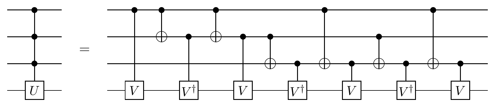

For control bits $x_1,x_2,x_3$, the operations applied to the fourth bit are

| Operation | Condition | Code word |
|---|---|---|
| $V$ | $x_1=1$ | 100 |
| $V^\dagger$ | $x_1\oplus x_2=1$ | 110 |
| $V$ | $x_2=1$ | 010 |
| $V^\dagger$ | $x_2\oplus x_3=1$ | 011 |
| $V$ | $x_1\oplus x_2\oplus x_3=1$ | 111 |
| $V^\dagger$ | $x_1\oplus x_3=1$ | 101 |
| $V$ | $x_3=1$ | 001 |

The strings encode which input bits occur in each parity condition. They form a Gray-code sequence, and their parity determines whether to apply $V$ or $V^\dagger$. The identity

$$
\begin{aligned}
x_1+x_2+x_3
&-(x_1\oplus x_2)-(x_1\oplus x_3)-(x_2\oplus x_3)\\
&+(x_1\oplus x_2\oplus x_3)
=4(x_1\wedge x_2\wedge x_3)
\end{aligned}
$$

shows that the sequence applies $V^4$ to the target if and only if all three controls are one. It therefore realizes $\wedge_3(V^4)$.

**Lemma 7.1.** For any $n\geq3$ and unitary $2\times2$ matrix $U$, a $\wedge_{n-1}(U)$ gate can be simulated by an $n$-bit network containing

$$
2^{n-1}-1
$$

controlled $V$ and $V^\dagger$ gates, together with

$$
2^{n-1}-2
$$

XOR gates, for a suitable unitary $V$.

The proof is omitted in the paper. It generalizes the $n=4$ example by choosing

$$
V^{2^{n-2}}=U
$$

and implementing the inclusion-exclusion identity

$$
\begin{aligned}
&\sum_{k_1}x_{k_1}
-\sum_{k_1<k_2}(x_{k_1}\oplus x_{k_2})
+\sum_{k_1<k_2<k_3}(x_{k_1}\oplus x_{k_2}\oplus x_{k_3})
-\cdots\\
&\qquad
+(-1)^{m-1}(x_1\oplus x_2\oplus\cdots\oplus x_m)
=2^{m-1}(x_1\wedge x_2\wedge\cdots\wedge x_m)
\end{aligned}
$$

with a Gray-code sequence.

For the small cases $n=3,4,5,6,7,8$, this was the most efficient known technique in the paper for arbitrary $\wedge_{n-1}(U)$ gates and for $\wedge_{n-1}(\sigma_x)$. After gate merging, it requires

$$
3\cdot2^{n-1}-4
$$

XOR gates and

$$
2\cdot2^{n-1}
$$

one-bit gates. This is $\Theta(2^n)$ and therefore very inefficient asymptotically. The remainder of the section develops quadratic exact constructions in the general case and linear constructions in several important cases.

### 7.1. Linear simulation of $\wedge_{n-2}(\sigma_x)$ gates on $n$-bit networks

**Lemma 7.2.** If $n\geq5$ and

$$
m\in\left\{3,\ldots,\left\lceil\frac n2\right\rceil\right\},
$$

then a $\wedge_m(\sigma_x)$ gate can be simulated by a network of $4(m-2)$ three-bit Toffoli gates $\wedge_2(\sigma_x)$ of the form below. The drawing shows $n=9$ and $m=5$.

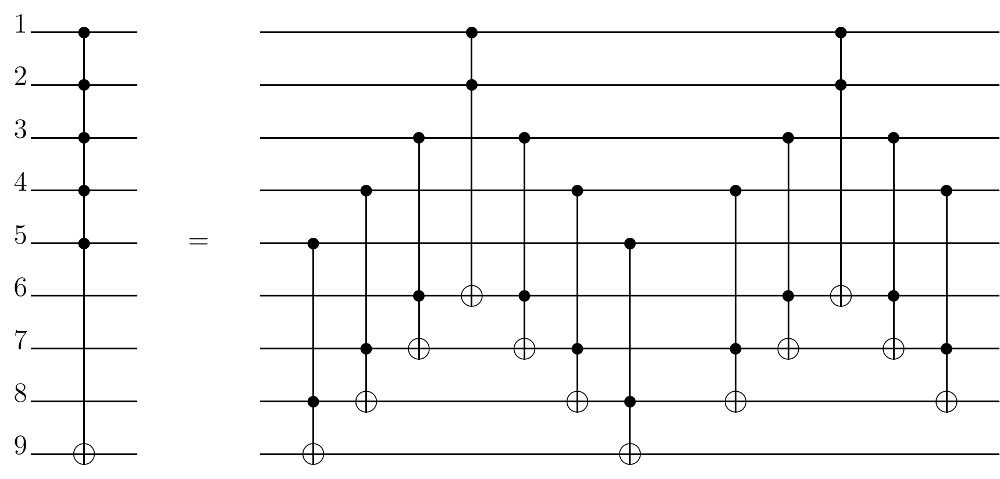

**Proof.** Consider the first seven gates in the illustrated network. The sixth bit is negated if and only if the first two bits are one; the seventh is negated if and only if the first three are one; the eighth is negated if and only if the first four are one; and the ninth is negated if and only if the first five are one. The last bit is therefore set correctly, while the three preceding bits are altered. The final five gates restore those three bits. $\square$

Although several bits not formally belonging to the target gate are operated on, the construction works independently of their initial states: they need not be cleared to zero, and they are restored to their original values afterward. This resembles the computations in [41] and [40] and makes the next construction possible.

**Lemma 7.3.** For any $n\geq5$ and $m\in\{2,\ldots,n-3\}$, a $\wedge_{n-2}(\sigma_x)$ gate can be simulated by a network containing two $\wedge_m(\sigma_x)$ gates and two $\wedge_{n-m-1}(\sigma_x)$ gates, as illustrated below for $n=9$ and $m=5$.

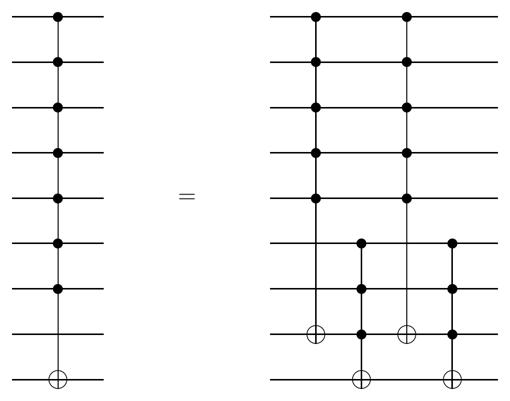

**Proof.** By inspection. $\square$

**Corollary 7.4.** On an $n$-bit network with $n\geq7$, a $\wedge_{n-2}(\sigma_x)$ gate can be simulated by

$$
8(n-5)
$$

three-bit Toffoli gates, or by

$$
48n-204
$$

basic operations.

**Proof.** Apply Lemma 7.2 with

$$
m_1=\left\lceil\frac n2\right\rceil,
\qquad
m_2=n-m_1-1,
$$

to simulate $\wedge_{m_1}(\sigma_x)$ and $\wedge_{m_2}(\sigma_x)$, and combine them using Lemma 7.3. Each resulting $\wedge_2(\sigma_x)$ can then be decomposed into basic operations as in Corollary 6.2.

Almost all of these Toffoli gates need only be simulated modulo phase factors as in Section 6.2. Only four gates - those involving the final bit in the diagram - must be simulated exactly. Those four use sixteen basic operations each, while the remaining $8n-36$ Toffoli gates use six. Careful accounting for mergers of one-bit gates gives the stated total. $\square$

These asymptotically efficient constructions require at least one extra bit: an $n$-bit network is used to simulate the $(n-1)$-bit gate $\wedge_{n-2}(\sigma_x)$.

### 7.2. Quadratic simulation of general $\wedge_{n-1}(U)$ gates on $n$-bit networks

**Lemma 7.5.** For any unitary $2\times2$ matrix $U$, a $\wedge_{n-1}(U)$ gate can be simulated by the following network, illustrated for $n=9$, where $V$ is unitary.

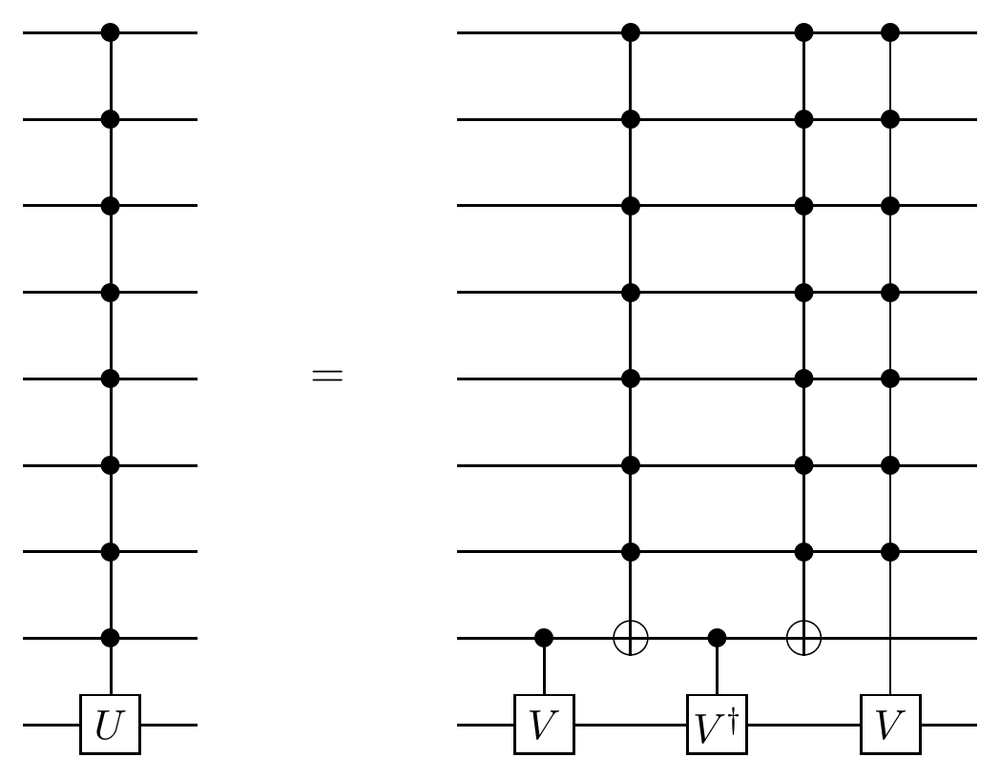

**Proof.** The proof is the same as for Lemma 6.1, with $V^2=U$. $\square$

**Corollary 7.6.** For any unitary $U$, a $\wedge_{n-1}(U)$ gate can be simulated using $\Theta(n^2)$ basic operations.

**Proof.** Let $C_{n-1}$ be the cost of simulating an arbitrary $\wedge_{n-1}(U)$. In Lemma 7.5, the $\wedge_1(V)$ and $\wedge_1(V^\dagger)$ gates cost $\Theta(1)$ by Corollary 5.3. The two $\wedge_{n-2}(\sigma_x)$ gates cost $\Theta(n)$ by Corollary 7.4. Recursively simulating the $\wedge_{n-2}(V)$ gate costs $C_{n-2}$. Hence

$$
C_{n-1}=C_{n-2}+\Theta(n),
$$

which gives

$$
C_{n-1}\in\Theta(n^2).
$$

$\square$

Using the more detailed gate counting of Corollary 7.4, the paper obtains

$$
48n^2+O(n)
$$

basic operations.

The exact upper bound is polynomial, but it remains natural to ask whether a subquadratic simulation is possible. The following gives a linear lower bound.

**Lemma 7.7.** Any simulation of a nonscalar $\wedge_{n-1}(U)$ gate, meaning

$$
U\neq\operatorname{Ph}(\delta)I,
$$

requires at least $n-1$ basic operations.

**Proof.** Consider an $n$-bit network with arbitrarily many one-bit gates but fewer than $n-1$ XOR gates. Call two bits *adjacent* if an XOR gate connects them, and *connected* if a chain of adjacent bits joins them. With fewer than $n-1$ XOR gates, the bits can be partitioned into two nonempty sets $A$ and $B$ such that no bit in $A$ is connected to any bit in $B$. The network's unitary transformation must therefore factor as

$$
A\otimes B,
$$

where the first factor has dimension $2^{\lvert A\rvert}$ and the second has dimension $2^{\lvert B\rvert}$. A nonscalar $\wedge_{n-1}(U)$ does not have this form, so the network cannot compute it. $\square$

A linear-size exact simulation of general $\wedge_{n-1}(U)$ gates remained conceivable but was not established. The remaining subsections show several senses in which something similar to a linear construction is possible.

### 7.3. Linear approximate simulation of general $\wedge_{n-1}(U)$ gates

**Definition.** One network *approximates* another within $\varepsilon$ if the distance, induced by the Euclidean vector norm, between their unitary transformations is at most $\varepsilon$.

This approximation notion was introduced in this context by Coppersmith [33]. If two approximately equal networks are executed on identical inputs and measured, then for any event the two outcome probabilities differ by at most $2\varepsilon$.

**Lemma 7.8.** For any unitary $2\times2$ matrix $U$ and $\varepsilon>0$, a $\wedge_{n-1}(U)$ gate can be approximated within $\varepsilon$ using

$$
\Theta\!\left(n\log\frac1\varepsilon\right)
$$

basic operations.

**Proof.** Apply Lemma 7.5 recursively as in Corollary 7.6, but choose the successive roots so that the recursion can be stopped after $\Theta(\log(1/\varepsilon))$ levels.

Since $U$ is unitary, there exist unitary matrices $P$ and $D$ such that

$$
U=P^\dagger DP,
\qquad
D=
\begin{pmatrix}
e^{id_1}&0\\
0&e^{id_2}
\end{pmatrix},
$$

where $d_1$ and $d_2$ are real and $e^{id_1}$ and $e^{id_2}$ are the eigenvalues of $U$. If $V_k$ is the matrix used at the $k$th recursive level, it is sufficient that

$$
V_{k+1}^2=V_k.
$$

Set

$$
V_k=P^\dagger D_kP,
$$

where

$$
D_k=
\begin{pmatrix}
e^{id_1/2^k}&0\\
0&e^{id_2/2^k}
\end{pmatrix}.
$$

Then

$$
\begin{aligned}
\lVert V_k-I\rVert_2
&=\lVert P^\dagger D_kP-I\rVert_2\\
&=\lVert P^\dagger(D_k-I)P\rVert_2\\
&\leq\lVert P^\dagger\rVert_2\,\lVert D_k-I\rVert_2\,\lVert P\rVert_2\\
&=\lVert D_k-I\rVert_2\\
&\leq\frac\pi{2^k}.
\end{aligned}
$$

Terminate the recursion after

$$
k=\left\lceil\log_2\left(\frac\pi\varepsilon\right)\right\rceil
$$

levels. The remaining discrepancy is an $(n-k)$-bit transformation of the form $\wedge_{n-k-1}(V_k)$, and

$$
\left\lVert
\wedge_{n-k-1}(V_k)-\wedge_{n-k-1}(I)
\right\rVert_2
=
\lVert V_k-I\rVert_2
\leq
\frac\pi{2^{\left\lceil\log_2(\pi/\varepsilon)\right\rceil}}
\leq\varepsilon.
$$

Thus the resulting network approximates $\wedge_{n-1}(U)$ within $\varepsilon$. $\square$

### 7.4. Linear simulation in special cases

**Lemma 7.9.** For any $W\in SU(2)$, a $\wedge_{n-1}(W)$ gate can be simulated by the network below, with $A,B,C\in SU(2)$.

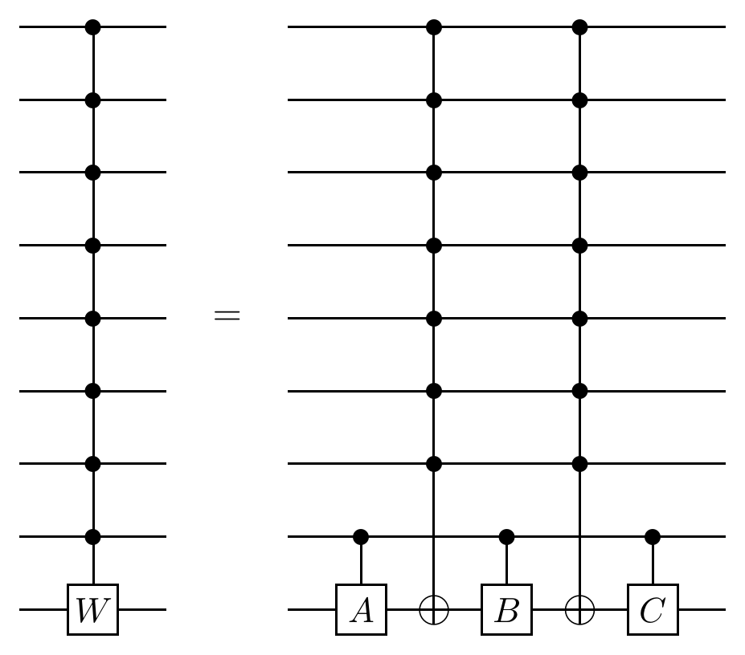

**Proof.** The proof is the same as Lemma 5.1, using Lemma 4.3. $\square$

Combining Lemma 7.9 with Corollary 7.4 gives:

**Corollary 7.10.** For any $W\in SU(2)$, a $\wedge_{n-2}(W)$ gate can be simulated using $\Theta(n)$ basic operations.

A noteworthy example is

$$
W=
\begin{pmatrix}
0&1\\
-1&0
\end{pmatrix}
=\operatorname{Ph}\!\left(\frac\pi2\right)\sigma_y.
$$

This gives a linear simulation of a transformation congruent modulo phase shifts to the $n$-bit Toffoli gate $\wedge_{n-1}(\sigma_x)$.

### 7.5. Linear simulation of general $\wedge_{n-2}(U)$ gates with one fixed bit

**Lemma 7.11.** For any unitary $U$, a $\wedge_{n-2}(U)$ gate can be simulated by the $n$-bit network below, illustrated for $n=9$, if one bit - the second-to-last bit in the drawing - begins in the fixed state zero. The auxiliary bit incurs no net change.

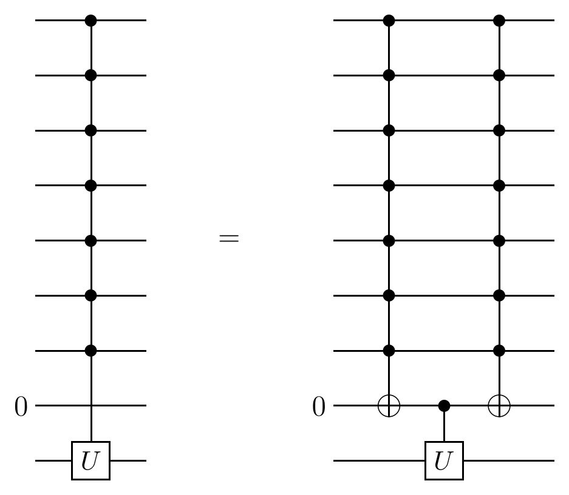

**Proof.** By inspection. $\square$

Combining Lemma 7.11 with Corollary 7.4 yields:

**Corollary 7.12.** For any unitary $U$, a $\wedge_{n-2}(U)$ gate can be simulated using $\Theta(n)$ basic operations in an $n$-bit network when one bit has a fixed initial value and is restored afterward.

The extra bit can be reused across several simulations of $\wedge_m(U)$ gates.

## 8. Efficient general gate constructions

The final discussion changes the definition of a basic operation: any arbitrary two-bit unitary is now counted as one basic gate. This may or may not be physically reasonable in a particular implementation, but it is mathematically convenient for addressing more general synthesis questions.

With arbitrary two-bit gates as primitives:

- five operations suffice to produce the exact Toffoli gate, by Lemma 6.1;
- three operations produce the Toffoli gate modulo phases, after merging gates in the Section 6.2 construction;
- thirteen operations produce the four-bit Toffoli gate, by Lemma 7.1.

The paper does not prove these counts minimal, though numerical evidence supported minimality in most of the cases [44].

How many arbitrary two-bit gates are required to implement a general three-bit unitary in $U(8)$? The answer given is six, arranged as follows.

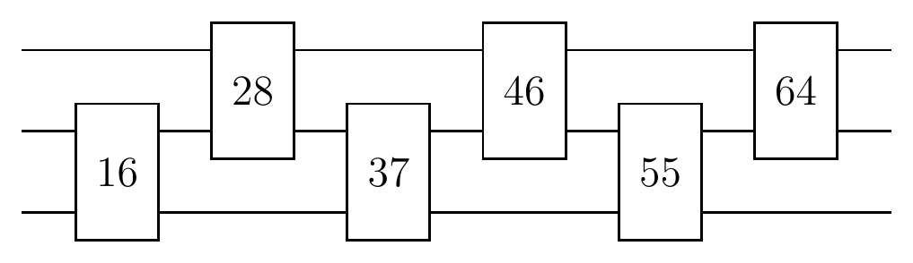

The numbers in the diagram give the dimensionality of the space accessible after each gate. The first $U(4)$ gate has

$$
4^2=16
$$

free angular parameters. Adding the second gate increases the dimension by only twelve, to 28, rather than by sixteen. One dimension is lost because the two gates share a global phase, and three are lost because operations acting only on the shared bit are duplicated. Formally, twelve is the dimension of the coset space

$$
SU(4)/SU(2).
$$

The third gate adds nine dimensions:

$$
9=16-1-3-3,
$$

which is the dimension of

$$
SU(4)/(SU(2)\times SU(2)).
$$

Each subsequent gate adds another nine dimensions until the sixth gate reaches 64, the dimension of $U(8)$. Preliminary four-bit tests followed the same dimensionality rules. Dimension counting therefore suggests the lower bound

$$
\Omega(n)=\frac19 4^n-\frac13n-\frac19
$$

on the number of arbitrary two-bit gates needed for a general $n$-bit unitary. Thus almost all unitary transformations require exponentially many operations and are computationally uninteresting.

The paper finally combines its constructions with the unitary-matrix decomposition used by Reck *et al.* [15]. Any unitary operator on $n$ bits can be simulated exactly, without work bits, using

$$
\Theta(n^3 4^n)
$$

arbitrary two-bit gates.

Reck *et al.* decompose a general unitary into operations acting on pairs of basis states:

$$
U=
\left(
\prod_{\substack{x_1,x_2\in\{0,1\}^m\\x_1>x_2}}
T(x_1,x_2)
\right)D.
$$

Each $T(x_1,x_2)$ performs a $U(2)$ rotation involving only the two basis states $x_1$ and $x_2$ and leaves every other basis state unchanged. The diagonal matrix $D$ contains phase factors and can itself be viewed as a product of $2^{n-1}$ rotations in two-dimensional subspaces.

Each $T(x_1,x_2)$ can be simulated in polynomial time by writing a Gray code connecting $x_1$ and $x_2$. For example, when $n=8$,

```text
1  00111010  x1
2  00111011
3  00111111
4  00110111
5  00100111  x2
```

Adjacent Gray-code words differ in one bit. The corresponding transition is a modification of a $\wedge_{n-1}$ gate. The $n-1$ control bits that remain unchanged are not necessarily all one, but NOT gates $\wedge_0(\sigma_x)$ can temporarily invert the zero controls before the multi-controlled operation and restore them afterward.

The desired $T(x_1,x_2)$ is then built in three stages:

1. Move the basis state down the Gray-code chain with the permutations $(1,2),(2,3),(3,4),\ldots,(m-2,m-1)$. Each permutation uses a modified $\wedge_{n-1}(\sigma_x)$.
2. Apply the desired $U(2)$ rotation with a modified $\wedge_{n-1}(U)$ acting on Gray-code states $(m-1)$ and $m$.
3. Undo the permutations in reverse order: $(m-2,m-1),(m-3,m-2),\ldots,(2,3),(1,2)$.

Each $T(x_1,x_2)$ uses $2m-3$ modified $\wedge_{n-1}$ gates. Each such gate costs $\Theta(n^2)$ basic operations, and a Gray code has at most $n+1$ elements, so one $T(x_1,x_2)$ costs $\Theta(n^3)$. There are $O(4^n)$ such $T$ operations, giving the total

$$
\Theta(n^3 4^n).
$$

The cost of simulating $D$ is smaller and does not change the asymptotic count. The upper bound differs from the dimension-counting lower bound only by a polynomial factor, so the Reck procedure is relatively efficient despite its exponential scaling. Its serious drawback is that it is unlikely to discover polynomial-size implementations for the special structured unitaries that permit them - precisely the transformations of greatest interest in quantum computation. A genuinely efficient and useful design methodology for quantum gate construction remained to be found.

## Acknowledgments

The authors thank H.-F. Chau, D. Coppersmith, D. Deutsch, A. Ekert, and T. Toffoli for helpful discussions. They also thank the Institute for Scientific Interchange in Torino and its director, Professor Mario Rasetti, for hosting the October 1994 quantum-computation workshop at which much of the work was performed. A. Barenco acknowledges financial support from the Berrow's Fund at Lincoln College, Oxford.

## References

1. P. A. M. Dirac, *The Principles of Quantum Mechanics* (Oxford, 1958), Chap. 5; for a modern treatment, see A. Peres, *Quantum Theory: Concepts and Methods* (Kluwer, 1993), Chap. 8.6.
2. R. Landauer, "Irreversibility and heat generation in the computing process," *IBM J. Res. Dev.* **5**, 183 (1961); C. H. Bennett, "Logical reversibility of computation," *IBM Journal of Research and Development* **17**, 525 (1973); Y. Lecerf, "Machines de Turing reversibles. Recursive insolubilite en $n\in\mathbb N$ de l'equation $u=\theta^n$ ou $\theta$ est un isomorphism de codes," *Comptes Rendus* **257**, 2597-2600 (1963); C. H. Bennett, "Time/space trade-offs for reversible computation," *SIAM J. Comput.* **18**, 766 (1989). For a review, see C. H. Bennett and R. Landauer, "Physical limits of computation," *Scientific American*, July 1985, p. 48.
3. E. Fredkin and T. Toffoli, "Conservative Logic," *Internat. J. Theoret. Phys.* **21**, 219 (1982).
4. T. Toffoli, "Reversible Computing," in *Automata, Languages and Programming*, edited by J. W. de Bakker and J. van Leeuwen (Springer, New York, 1980), p. 632; Technical Memo MIT/LCS/TM-151, MIT Laboratory for Computer Science, unpublished.
5. P. Benioff, "Quantum mechanical Hamiltonian models of Turing machines," *J. Stat. Phys.* **29**, 515 (1982).
6. A. Peres, "Reversible logic and quantum computers," *Phys. Rev. A* **32**, 3266 (1985).
7. R. P. Feynman, "Quantum mechanical computers," *Optics News*, February 1985, vol. 11, p. 11.
8. N. Margolus, "Parallel Quantum Computation," in *Complexity, Entropy, and the Physics of Information*, Santa Fe Institute Studies in the Sciences of Complexity, Vol. VIII, edited by W. H. Zurek (Addison-Wesley, 1990), p. 273.
9. T. Sleator and H. Weinfurter, "Realizable universal quantum logic gates," preprint (1994).
10. A. Barenco, D. Deutsch, A. Ekert, and R. Jozsa, "Logic gates for quantum circuits," preprint (1994).
11. J. I. Cirac and P. Zoller, "Quantum computations with cold trapped ions," preprint (November 1994).
12. I. Chuang and Y. Yamamoto, "A simple quantum computer," submitted to *Phys. Rev. A* (November 1994).
13. Y. Yamamoto, M. Kitagawa, and K. Igeta, in *Proceedings of the 3rd Asia-Pacific Physics Conference* (World Scientific, Singapore, 1988); G. J. Milburn, *Phys. Rev. Lett.* **62**, 2124 (1989).
14. S. Lloyd, "A potentially realizable quantum computer," *Science* **261**, 1569 (1993); "Envisioning a quantum supercomputer," *Science* **263**, 695 (1994).
15. M. Reck, A. Zeilinger, H. J. Bernstein, and P. Bertani, "Experimental realization of any discrete unitary operator," *Phys. Rev. Lett.* **73**, 58 (1994).
16. D. Deutsch, "Quantum theory, the Church-Turing principle and the universal quantum computer," *Proc. R. Soc. Lond. A* **400**, 97 (1985).
17. D. Deutsch and R. Jozsa, "Rapid solution of problems by quantum computation," *Proceedings of the Royal Society of London A* **439**, 553-558 (1992).
18. A. Berthiaume and G. Brassard, "Oracle quantum computing," in *Proceedings of the Workshop on Physics and Computation - PhysComp '92* (IEEE Press, 1992), pp. 195-199.
19. D. Simon, "On the power of quantum computation," in *Proceedings of the 35th Annual Symposium on Foundations of Computer Science* (IEEE Computer Society Press, Los Alamitos, CA, 1994), p. 116.
20. E. Bernstein and U. Vazirani, "Quantum complexity theory," in *Proceedings of the 25th Annual ACM Symposium on Theory of Computing* (ACM Press, New York, 1993), pp. 11-20.
21. P. W. Shor, "Algorithms for quantum computation: discrete log and factoring," in *Proceedings of the 35th Annual Symposium on Foundations of Computer Science* (IEEE Computer Society Press, Los Alamitos, CA, 1994), p. 124.
22. For a review, see A. Ekert and R. Jozsa, "Shor's quantum algorithm for factorising numbers," in preparation for *Reviews of Modern Physics* (1995); see also J. Brown, *New Scientist* **133**, No. 1944, p. 21 (1994).
23. G. Brassard, "Cryptography Column - Quantum Computing: The End of Classical Cryptography?" *SIGACT News* **25**(4), 15 (1994).
24. D. Deutsch, "Quantum computational networks," *Proc. Roy. Soc. Lond. A* **425**, 73 (1989).
25. B. Schumacher, "On Quantum Coding," *Phys. Rev. A*, in press (1995).
26. R. Jozsa and B. Schumacher, "A New Proof of the Quantum Noiseless Coding Theorem," *J. Modern Optics* **41**, 2343-2349 (1994).
27. A. C.-C. Yao, "Quantum Circuit Complexity," in *Proceedings of the 34th Annual Symposium on Foundations of Computer Science* (IEEE Computer Society Press, Los Alamitos, CA, 1993), p. 352.
28. D. P. DiVincenzo, "Two-bit gates are universal for quantum computation," *Phys. Rev. A* **50**, 1015 (1995), `cond-mat/9407022`.
29. A. Barenco, "A universal two-bit gate for quantum computation," preprint (1994).
30. S. Lloyd, "Almost any quantum logic gate is universal," preprint (1994).
31. D. Deutsch, A. Barenco, and A. Ekert, "Universality in quantum computation," submitted to *Proc. R. Soc. Lond.* (1995).
32. H. F. Chau and F. Wilczek, "Realization of the Fredkin gate using a series of one- and two-body operators," Report IASSNS-HEP-95/15 (1995), `quant-ph/9503005`.
33. D. Coppersmith, "An approximate Fourier transform useful in quantum factoring," IBM Research Report RC19642 (1994); R. Cleve, "A note on computing Fourier transforms by quantum programs," unpublished note (1994).
34. A. Berthiaume, D. Deutsch, and R. Jozsa, "The stabilisation of quantum computations," in *Proceedings of the Workshop on Physics and Computation, PhysComp '94* (IEEE Computer Society Press, Los Alamitos, 1994), p. 60.
35. W. G. Unruh, "Maintaining coherence in quantum computers," *Phys. Rev. A* **51**, 992 (1995), `hep-th/9406058`.
36. I. L. Chuang, R. Laflamme, P. Shor, and W. H. Zurek, "Quantum Computers, Factoring and Decoherence," Report LA-UR-95-241 (1995), `quant-ph/9503007`.
37. R. Landauer, "Is quantum mechanics useful?" *Proc. Roy. Soc. Lond.*, to be published.
38. The only nontrivial one-bit classical invertible operation is $\sigma_x=\begin{pmatrix}0&1\\1&0\end{pmatrix}$.
39. D. Coppersmith and E. Grossman, "Generators for Certain Alternating Groups with Applications to Cryptography," *SIAM J. Applied Math.* **29**(4), 624-627 (1975).
40. R. Cleve, "Reversible Programs and Simple Product Ciphers," in *Methodologies for Designing Block Ciphers and Cryptographic Protocols*, Ph.D. thesis, University of Toronto, pp. 2-56 (1989).
41. M. Ben-Or and R. Cleve, "Computing algebraic formulas using a constant number of registers," *SIAM J. Comput.* **21**, 54 (1992).
42. Corresponding to the definition in Section 2, the top two wires contain the input bits $x_1$ and $x_2$, and the third wire contains the input $y$.
43. The angle-halving in the rotation definitions conforms to the usual relation between operations in $SO(3)$ and $SU(2)$. See J. Mathews and R. L. Walker, *Mathematical Methods of Physics*, 2nd ed. (W. A. Benjamin, Menlo Park, CA, 1970), p. 464, for the use of rigid-body-rotation language to describe $SU(2)$ operations.
44. D. P. DiVincenzo and J. Smolin, "Results on two-bit gate design for quantum computers," in *Proceedings of the Workshop on Physics and Computation, PhysComp '94* (IEEE Computer Society Press, Los Alamitos, 1994), p. 14, `cond-mat/9409111`.
